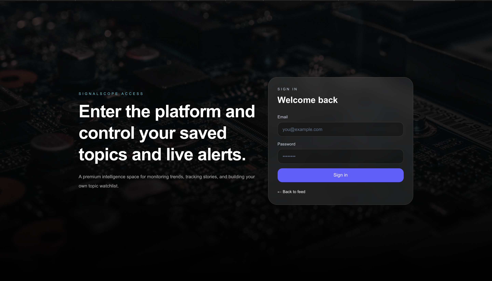
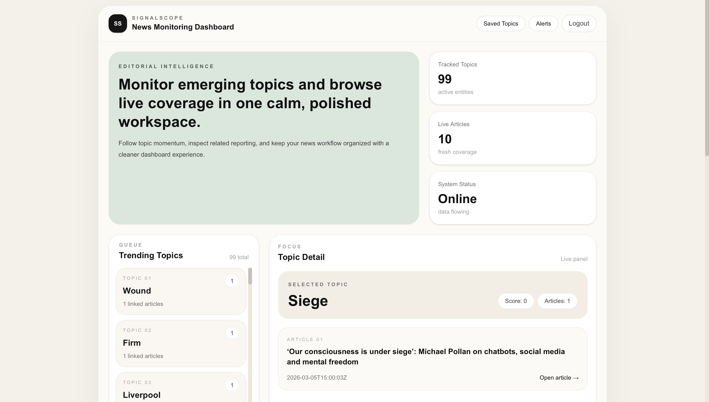
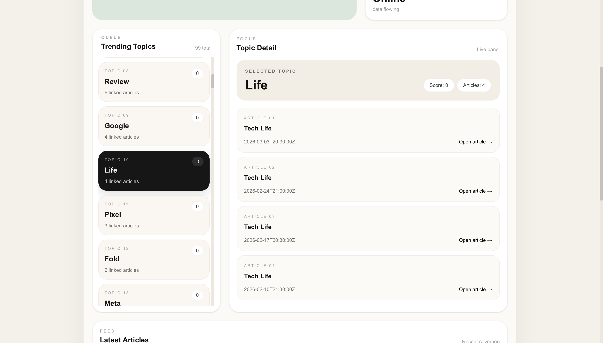
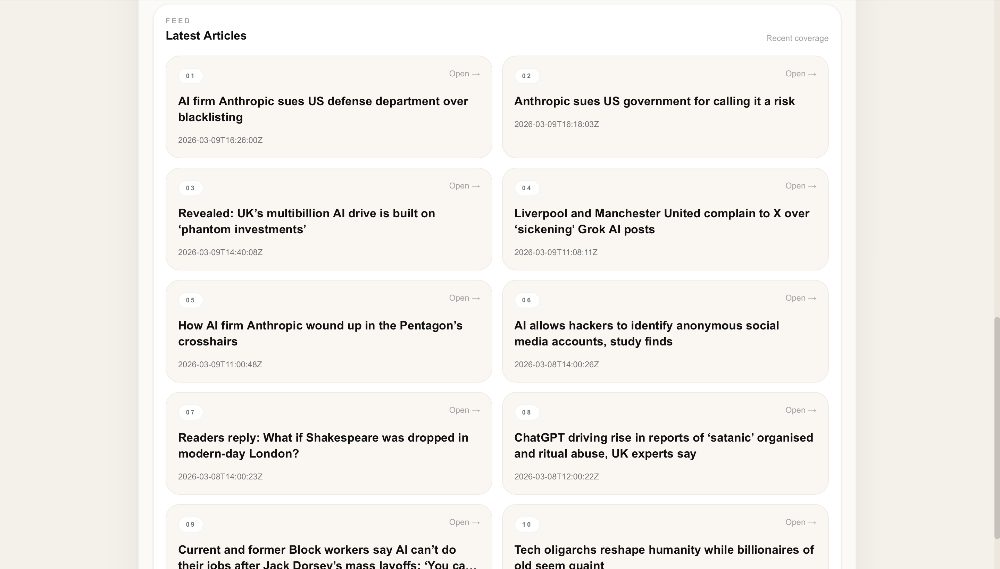
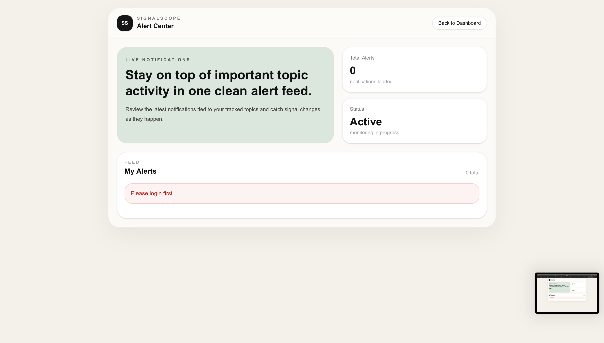

# SignalScope

### Login

### Dashboard

### Topics & Details

### Articles

### Alerts

----

SignalScope

SignalScope is a full-stack platform for monitoring emerging news topics and exploring related coverage in real time.

The system ingests articles from RSS feeds, extracts topics from those articles, calculates topic momentum, and exposes the results through a clean API and interactive web dashboard.

It demonstrates how automated ingestion, background processing, and modern frontend tooling can be combined to build a lightweight news intelligence system.

⸻

Screenshots

Dashboard

A real-time overview of trending topics detected across incoming news articles.

Topic Detail

View a specific topic, explore related coverage, and follow its momentum over time.

Articles Feed

Browse the latest articles collected by the ingestion pipeline.

Alerts Center

Manage alerts and notifications for topics you want to track.

Authentication

Simple login and registration flow using JWT authentication.

⸻

Features
	•	RSS news ingestion pipeline
	•	Automatic topic extraction from articles
	•	Trending topic detection and ranking
	•	Topic exploration with related articles
	•	Latest article feed
	•	User authentication with JWT
	•	Saved topics
	•	Topic alerts and notifications
	•	Cached API responses for performance
	•	Dockerized development environment

⸻

Architecture

SignalScope follows a pipeline architecture designed for continuous ingestion and processing of news data.

RSS Feeds
     ↓
Article Ingestion (Celery Workers)
     ↓
Topic Detection
     ↓
Trend Scoring
     ↓
Django REST API
     ↓
React Dashboard

Key components:

Ingestion Layer
	•	Fetches RSS feeds
	•	Parses and stores new articles

Processing Layer
	•	Extracts topics from articles
	•	Calculates trending scores

API Layer
	•	Exposes topics, articles, and alerts through REST endpoints

Frontend
	•	Interactive dashboard for exploring topics and articles

⸻

Tech Stack

Backend
	•	Python
	•	Django
	•	Django REST Framework
	•	Celery
	•	Redis
	•	PostgreSQL / SQLite
	•	Docker

Frontend
	•	React
	•	Axios
	•	TailwindCSS

⸻

API Overview

Topics

GET /api/signals/topics/
GET /api/signals/topics/<topic_name>/

Returns trending topics and detailed information for a specific topic.

⸻

Articles

GET /api/news/articles/

Returns the latest articles collected by the ingestion pipeline.

⸻

Authentication

POST /api/auth/login/
POST /api/auth/register/

JWT-based authentication for accessing user features.

⸻

Saved Topics

GET    /api/auth/saved-topics/
POST   /api/auth/saved-topics/
DELETE /api/auth/saved-topics/<id>/

Allows users to follow topics of interest.

⸻

Alerts

GET   /api/alerts/
PATCH /api/alerts/<id>/

Manage topic alerts and notification settings.

⸻

Running the Project

1. Clone the repository

git clone https://github.com/Mirzaei44/signalscope.git
cd signalscope

⸻

2. Install backend dependencies

pip install -r requirements.txt

⸻

3. Run database migrations

python manage.py migrate

⸻

4. Start the backend

python manage.py runserver

⸻

5. Run the frontend

cd frontend
npm install
npm run dev

⸻

Project Structure

signalscope
│
├── accounts/        # Authentication & user management
├── alerts/          # Alert and notification system
├── ingestion/       # RSS ingestion pipeline
├── news/            # Article models and API
├── signals/         # Topic extraction and trending logic
│
├── frontend/        # React frontend
├── assets/          # Project screenshots
│
├── docker-compose.yml
├── Dockerfile
├── requirements.txt
├── manage.py
└── README.md

⸻

Purpose

SignalScope explores how automated news ingestion and topic detection can power a lightweight news intelligence dashboard.

The project demonstrates:
	•	backend system design
	•	asynchronous processing with Celery
	•	REST API architecture
	•	frontend-backend integration
	•	containerized development workflows
